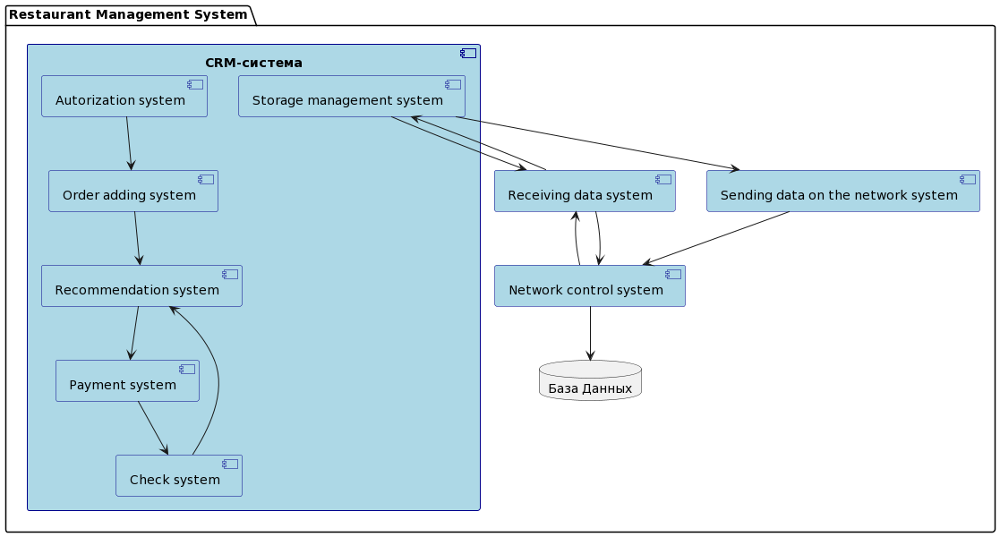

# Use case, user story, Component diagram и макет для CRM

1. >Use case - это описание взаимодействия субъекта и системы, в которой чаще всего описывается действующие лица, цель, предусловия, триггер, сценарии и постусловие.
   >>Use case CRM-системы описан первыми 13-ю пунктами и "нефункциональными требованиями" в файле [UML_crm.txt](./UML_CRM/UML_crm.txt)

2. >User story - это описание функционада какой-либо системы от лица определенного пользователя.
   >>User story CRM-системы описан девятью пунктами в файле [UML_crm.txt](./UML_crm.txt)

3. >Component diagram - это тип структурной диаграммы, используемый в UML (унифицированном языке моделирования) для визуализации организации и взаимосвязей компонентов системы.
   >>Component diagram CRM-системы описан 

4. >Макет CRM-системы позволяет на этапе проектирования увидеть как предварительно будет выглядеть интерфейс, а в последующем сверстать его, опираясь на макет.
    >>Макет CRM-системы находится в архиве [Предварительный макет.zip](./Предварительный_макет.zip)

    Ресурсы с которых взял информацию: 
    - [Yan_Davletshin](https://drive.google.com/drive/folders/1W8sHFyzeJb6k3UKr4-YtBE2X3K6-qQFN)
    - [Imil_Batmanov](https://docs.google.com/document/d/1EkUSkkmQ0EDrHGR7AA9hHIEKeKWHPIXG94A-Y5XAJH4/edit)
# UML_CRM
